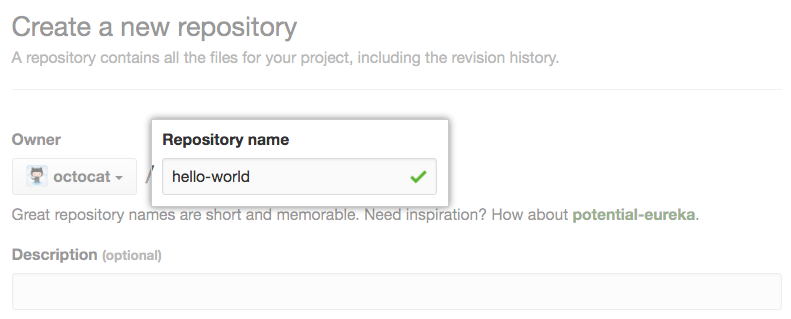

# Welcome To Reading01:

In this reading we are going to talk about [Github](https://github.com/ ) .the followings are the topics of 
this reading:

 1. GitHub Pages
   - Learning about GitHub
   - Using GitHub
      - Create a Repository
      - Some Git commend
    
 2. GitHub Markdown Syntax
   - Define markdown
   - Some markdown syntax
   

## 1. GitHub Pages: 
### 1.1  Learning about GitHub:
     Github is a space that allow developers to save and share there work . Github records changes to a file
     so we can recall specific versions later.
 ### 1.2 create a repository :
     A repository is like a folder for your project. Your project's repository contains all of your project's 
     files and stores each file's revision history. 
     These are the step to create a repository :

1. Go to [Github.com](https://github.com/)

2. Login (if first time user you gonna  need to sign in )

3. In the upper-right corner of any page, use the  drop-down menu, and select New repository.
       

4. Type a short, memorable name for your repository. For example, "hello-world".
       

### Somme Git Command:

- **Git clone** : this command allow us to import the repository on our local machine by using the following command :

       git clone ' the link to your repository'
        
- **Git status**: we use this command to chack the status of our repository by using the following command :

       git status
   
- **Git add** : this command add all the modification 

       git add .
  
- **Git commit** : Commit all local changes in tracked files

       git commit -md
    
- **Git push** : command is used to upload local repository content to a remote repository

       git push origin master
    
    
## 2.GitHub Markdown Syntax:

  - **Define markdowns :** 

 Markdown is a way to style text on the web. You control the display of the document; formatting words as bold or italic, adding images,and creating lists are just a few of the things we can do with Markdown. Mostly, Markdown is just regular text with a few non-alphabetic characters thrown in.
 

  - **Some markdown syntax :**

   Definition  | markdown syntax
------------ | -------------
List | - George Washington or 1. James Madison
Headings| ### largest heading or ##  the scond largest heading
Links | [GitHub Pages] (https://pages.github.com/).
Emoji| You can add emoji to your writing by typing :EMOJICODE:

      
